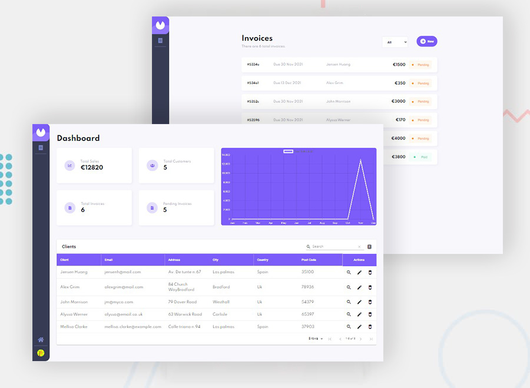

# Invoice App

### Tools

- [React.js](https://reactjs.org/)
- [MongoDB](https://www.mongodb.com/)
- [Axios](https://axios-http.com/)
- [Framer-motion](https://www.framer.com/motion/)
- [Chart.js](https://www.chartjs.org/)
- [Material-table](https://material-table.com/#/)
- [React-hook-form](https://react-hook-form.com/)

### Development

A billing/invoice app built using React and connected to Mongo database. The app permits to create clients and invoices aswell as shows a detailed feedback of the pending and paid invoices aswell as total sales via a chart created using Chart.js(a javascript library). Customer invoices can be directly accesed through the simplfied table created using material table and filtered as paid or pending. Invoices can be deleted and edited easily and deleting an invoice automatically deletes the associated invoice from the client invoices. Transitions using framer motion were a breeze and the forms validations are simplified and secured using React hook form.
